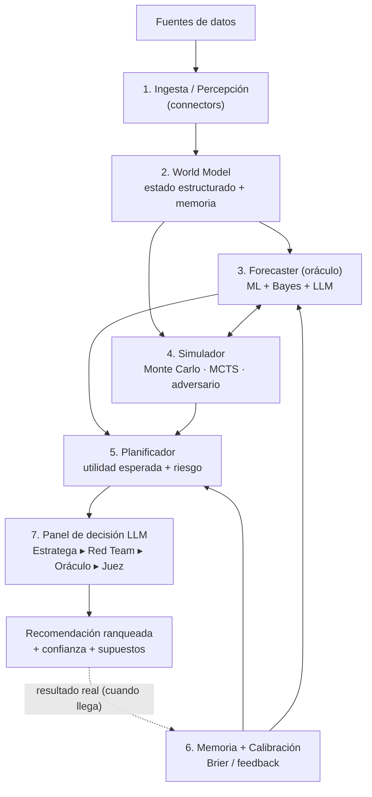

# Bucle OODA de Oraqlo

- **Observe:** Fuentes → Ingesta → World Model.
- **Orient:** Forecaster ⇄ Simulador (futuros probables y contramovimientos).
- **Decide:** Planificador → Panel (debate adversarial interno).
- **Act:** emitir recomendación; registrar cada predicción en Calibración para
  puntuarla cuando llegue el resultado real — el bucle de aprendizaje.
